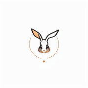
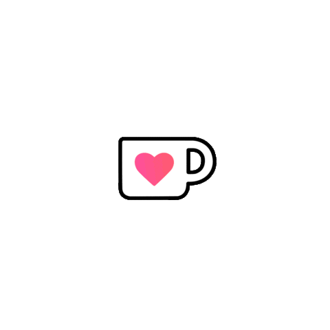

# Hello World!  

 
 

I am a versatilist and easily adapt to different hats (Full Stack Web Developer 🌐, App Developer 📱, AIGC Engineer 🤖 or beginner level Designer 🎨) depending on what the project requires. I love exploring new tech stack 💻 and leveraging them to build cool stuffs 🛠️.
 
 

### 🧐 &nbsp; More About Me:

- 🔭 &nbsp; I’m currently working as a Software Developer in  **Shenzhen, China**
- 🤝 &nbsp; I’m looking to collaborate on [AIGC](https://art.aigc8.cc/)
- 🌱 &nbsp; I’m currently learning Typescript; 
- 👨🏻‍💻 &nbsp; Most of my projects are available on [Github](https://github.com/raykindle?tab=raykindle)
- 💬 &nbsp; Ask me about anything tech related, I am happy to help;
- 📫 &nbsp; Feel free to ping me on [LinkedIn](https://www.linkedin.com/in/%E6%96%87%E4%BF%8A-%E5%BC%A0-4916b412b/)
- 📝 &nbsp; Checkout my [Resume]()
 
 

### 📫 &nbsp; How to reach me
  &nbsp; 
  &nbsp; 
  &nbsp; 
  &nbsp; 

 
 

### 🔨 &nbsp; Languages and Tools

 
 
 
 

### 🛠️ &nbsp; My Projects

 
 
 
 

##### 🥺 &nbsp; if you like what i do, maybe consider buying me a coffee

 
 

