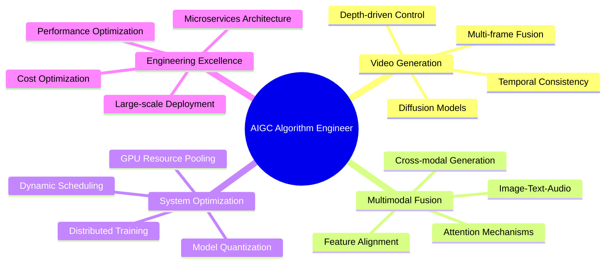

#   Hi, I'm Raykindle !

  

## 🚀 About Me

🎯 **Senior AIGC Algorithm Engineer** with **8 years** of experience in deep learning and computer vision  
🔬 Specialized in **Video Generation**, **Multimodal Fusion**, and **Large-scale AI System Optimization**  
💡 Led **30+ AI algorithm projects** from research to production, achieving **80% cost reduction** and **300% efficiency improvement**  
🏆 Expert in cutting-edge technologies: **Diffusion Models**, **Flux**, **Transformer Architecture**, **Wan**, **Vace FusioniX**

---

## 🛠️ Tech Stack

### 🤖 Generative Models

### 🧠 Deep Learning Frameworks

### ⚡ Optimization & Engineering

### 💻 Programming Languages

---

## 🌟 Featured Projects

### 🎬 AI Video Character Replacement Technology
> **Revolutionary video generation solution for gaming industry**

- 🔥 **Core Tech**: Vace FusioniX + Depth-driven Extraction + Flux Kontext Editing
- 🚀 **Innovation**: Layered injection strategy (scene-first, character-second) for natural fusion
- 📊 **Impact**: **6000% efficiency boost** (8 hours → 8 minutes), **70% cost reduction**
- 🎯 **Quality**: 1024×1024 resolution, 30fps, FID<15, **90%+ user satisfaction**

### 🏗️ AIGC Unified Framework Architecture
> **Large-scale AI service optimization and resource pooling**

- 🔧 **Architecture**: Microservices + Dynamic GPU Scheduling + Model Weight Sharing
- ⚡ **Optimization**: INT8 Quantization + Knowledge Distillation + Inference Graph Optimization
- 📈 **Results**: **80% cost reduction**, **85% GPU utilization**, **2x concurrent processing**
- 🎯 **Scale**: Supporting 20+ AIGC services with unified resource management

### 🚄 AI Service Performance Optimization
> **High-frequency AIGC service acceleration and cost optimization**

- 🔬 **Techniques**: Model Compression + TensorRT Acceleration + Smart Batching
- 📊 **Achievements**: **≥40% latency reduction**, **65% cost per instance reduction**
- 🎯 **Performance**: **1.8x QPS improvement**, **99.9% system stability**

### 🎨 ComfyUI Deep Customization Framework
> **Visual algorithm orchestration platform for rapid AIGC development**

- 🛠️ **Framework**: Modular design + Hot-swappable nodes + GPU memory sharing
- 🚀 **Efficiency**: **14 image algorithms** deployed, **3-day development cycle**
- 📈 **Impact**: **70% code reuse rate**, **60% debugging time reduction**

---

<!-- ## 📊 GitHub Stats

  
  

  

 -->

---

## 🏆 Key Achievements

- 🎯 **Cost Optimization**: Saved **millions of RMB** in computing costs through algorithmic innovations
- 🚀 **Efficiency Boost**: **60% improvement** in algorithm development efficiency across teams
- 🔬 **Technical Innovation**: **2 patents** filed in video generation and multimodal fusion
- 👥 **Team Leadership**: Mentored **3 junior engineers** to become algorithm experts

---

## 🌐 Core Expertise Areas

```mermaid
mindmap
  root((AIGC Algorithm Engineer))
    Video Generation
      Diffusion Models
      Temporal Consistency
      Multi-frame Fusion
      Depth-driven Control
    Multimodal Fusion
      Image-Text-Audio
      Feature Alignment
      Attention Mechanisms
      Cross-modal Generation
    System Optimization
      Model Quantization
      GPU Resource Pooling
      Dynamic Scheduling
      Distributed Training
    Engineering Excellence
      Microservices Architecture
      Performance Optimization
      Large-scale Deployment
      Cost Optimization
```

---

## 📈 Professional Impact

| Metric | Achievement | Impact |
|--------|-------------|---------|
| 💰 **Cost Reduction** | 80% | Millions saved in computing resources |
| ⚡ **Efficiency Gain** | 300% | Video generation speed improvement |
| 🎯 **GPU Utilization** | 85% | From 35% baseline optimization |
| 🚀 **Projects Delivered** | 30+ | AI algorithms in production |
| 👥 **Team Growth** | 60% | Development efficiency improvement |

---

## 📫 Let's Connect

---

  

  <h3>💡 "Transforming cutting-edge AI research into production-ready solutions"</h3>
  
<em>Passionate about pushing the boundaries of AIGC technology and creating impactful AI systems</em>

---

⭐ **If you find my work interesting, please consider giving my repositories a star!** ⭐
